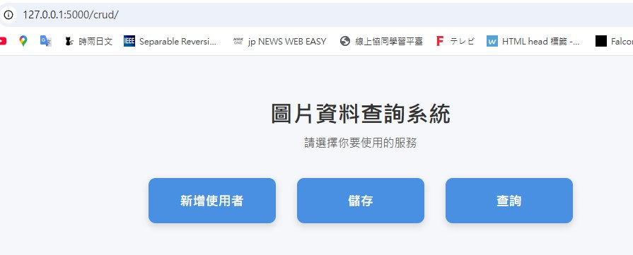

# Biometric Stego-Certificate System (LUpaperProject)
# 臉部辨識數位憑證隱寫系統

這是一個結合 **臉部辨識 (Face Recognition)** 與 **可逆影像隱寫術 (Reversible Data Hiding, RDH)** 的安全驗證系統。系統透過攝影機辨識使用者身分，並將其身分憑證加密嵌入影像中。

**製作構想與理論來源**：
本系統之核心演算法源自於作者之學位論文：[可回復式資訊隱藏方法實作](https://ndltd.ncl.edu.tw/cgi-bin/gs32/gsweb.cgi/ccd=HGI.J4/record?r1=1&h1=0)。本次製作之目的是驗證該 RDH 方法之有效性，並將其應用於數位身分憑證之保護。

> [!IMPORTANT]
> **Current Status**: 系統目前處於 概念驗證 階段。
> **Future Improvements (尚未完善)**：
> 1. 個別查詢/搜尋功能之整合。
> 2. 跨環境之可靠度與多人壓力測試。

---

## 核心技術區塊 (Core Technical Sections)

### 1. 資訊隱藏方法 (Reversible Data Hiding Method)
本系統採用**可回復式資訊隱藏 (RDH)** 技術，確保提取隱藏資訊後，原始載體影像能達成無損還原。


* **鄰近插值模型 (Interpolation)**：透過 `InterpolationModel.py` 在影像中創造冗餘空間。
* **3D 變換矩陣映射**：利用 `3Dmatrix.npy` 進行 3D 座標空間映射，將 Email 等憑證資訊嵌入像素差值，提升安全性。
* **手動驗證預處理**：支援「現場插值重建」，解決外部上傳影像缺乏對照圖的提取難題。

### 2. 臉部特徵掃描辨識 (Face Feature Recognition)
整合即時生物辨識，建立憑證與物理人臉的強連動關係。


* **特徵掃描**：透過 `face.py` 即時偵測臉部並提取高維特徵向量（Face Embeddings）。
* **身分綁定**：系統自動比對 `face_database.pkl`，確認身分後方可執行隱寫嵌入，確保「本人製作，本人驗證」。


### 3. 與flask整合
整合即時生物辨識及資訊隱藏方法，並利用flask整合


##  核心功能與快速開始
* **身分連動製作**：自動鎖定使用者 ID 與 Email，確保憑證真實性。
* **自動路徑備援**：優先搜尋 `D:\3Dmatrix.npy`，若不存在則自動切換至專案根目錄。
* **安全性**：強制執行 CSRF 防護與 3D 變換矩陣解密。
---
**測試前置作業**：
啟動測試前，請務必先執行根目錄下的 **`cube_label.exe`**，以生成必要的 3D 加密憑證檔案。

---

##  專案目錄結構 (Project Structure)
```text
paperProject/
│  .env                        # 環境變數設定 (Secret Key 等)
│  local.sqlite                # SQLite 資料庫檔案
│  README.md                   # 專案說明文件
│
├─apps/
│  │  3Dmatrix.npy             # 核心隱寫變換矩陣 (解碼關鍵)
│  │  app.py                   # Flask 應用程式進入點
│  │  __init__.py
│  │
│  ├─crud/                     # 系統核心邏輯模組
│  │  │  ArrayCredit.py        # 陣列處理相關工具
│  │  │  extraction_procedure.py # 隱寫資訊提取演算法
│  │  │  face.py               # 臉部辨識系統控制邏輯
│  │  │  face_database.pkl     # 已註冊人臉特徵資料庫
│  │  │  forms.py              # Flask-WTF 表單定義
│  │  │  full_Stego.py         # 隱寫嵌入完整流程控制
│  │  │  InterpolationModel.py  # 影像插值演算法模型
│  │  │  models.py             # SQLAlchemy 資料庫模型定義
│  │  │  views.py              # 路由控制器 (主要開發邏輯所在)
│  │  │  __init__.py
│  │  │
│  │  ├─templates/             # HTML 模板檔案
│  │  │  └─crud/
│  │  │      ├── index.html    # 系統首頁
│  │  │      ├── search.html   # 憑證驗證中心 (手動驗證頁面)
│  │  │      ├── stego_upload.html # 憑證製作頁面 (含攝影機控制)
│  │  │      └── ...           # 其他 CRUD 頁面
│  │  └─static/                # CRUD 模組專用靜態資源 (CSS)
│  │
│  └─static/                   # 全域靜態檔案存放區
│      ├─stego/
│      │  ├─1/                 # 使用者 ID 1 之憑證目錄
│      │  │  ├── Interpolation_image.png 
│      │  │  └── Stego_image.png         
│      │  ├─manual_temp/       # 手動驗證暫存區
│      │  └─manual_verify.png  
│      └─uploads/              # 原始載體影像上傳區
│
├─attendance_logs/             # 辨識紀錄日誌
└─migrations/                  # 資料庫遷移紀錄 (Flask-Migrate)


